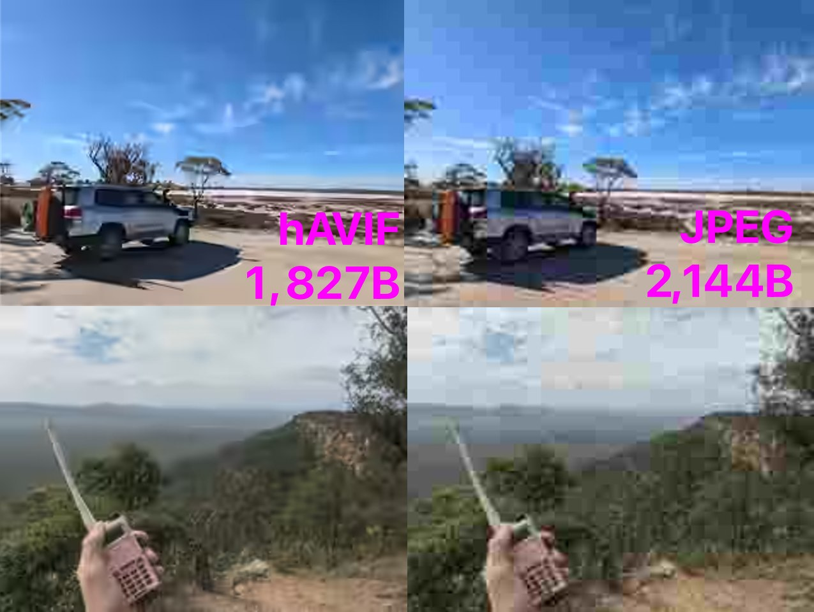

Using headerless AVIF for remote ~~twitter~~ mastodon shit posting
==



I wanted to be able to post photos remotely to ~~twitter~~ mastodon, even when internet or cell coverage isn't available. I don't have any sort of remote station and while I could use SDRs to receive I wouldn't get any feedback that the message was sent correctly.

Winlink network provides decent coverage around Australia. However Winlink doesn't have a good selection of free, opensource and Linux compatible modems. The only modem available for opensource and Linux is ardop. ardop isn't the fastest modem is the world and some bug in its implementation means that most file transfers over a couple of kilobytes usually fail.

This project provides two applications. A winlink to ~~twitter~~ mastodon email gateway (`mastodonses`) using AWS SES/Lambda and a tool to create headerless AVIF files (`havif`).

Both these projects are made purely for me - so you likely have to hack them up to work on your machine.

hAVIF
--

### Requirements
 - `sh` python library (`pip install sh`)
 - AVIF apps (`avifenc` / `avifdec`)
 - ImageMagicks `convert`

### How to use
```
$ python3 encode.py --help

usage: encode.py [-h] [--auto | --no-auto] [--min MIN] [--max MAX] image

Convert image to headerless avif.

positional arguments:
  image              Path to image

optional arguments:
  -h, --help         show this help message and exit
  --auto, --no-auto  attempts to get 2k output by lowering the quality (default: True)
  --min MIN          min avif quantization
  --max MAX          max avif quantization

$ python3 encode.py path-to-image.jpg
```


### How it works
The intention of hAVIF is to have a header already precalculated at both ends so that it doesn't need to be sent over the air.

1. Images are resized to `240x180` exactly.
2. Under auto mode avifenc runs lowering the quality until the file size is less than 2400
3. The header is stripped off
4. To test that everything worked correctly, the template header is added back on (`header.bytes`) and the header stride field is corrected.
5. The file is then converted back to PNG for a preview
6. The user can then choose to send the file over Winlink/pat

Since the output file has the header stripped off, the resolution must always be 240x180


mastodonses
--
This is a Lambda function that you can use to monitor for emails using SES. I don't have infrastructure documentation for this so you'll have to work this out for youself. 

The general idea is that SES sends a SNS notification which triggers this Lambda function.

The Lambda function decodes the image - puts the AVIF header back on, converts the image back to a PNG and then uploaded to ~~twitter~~ mastodon.